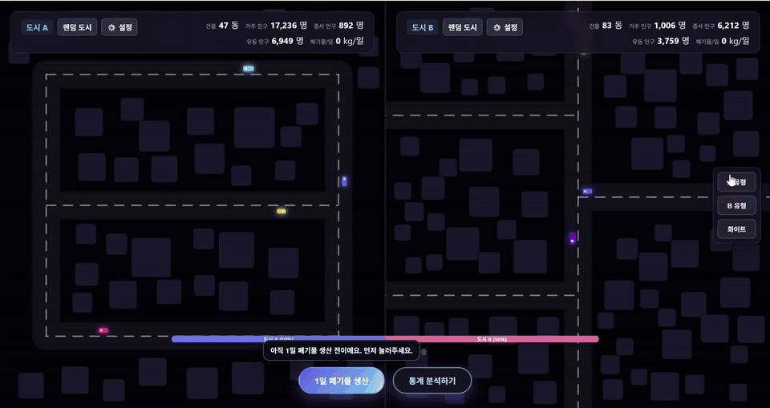

# 도시 폐기물 통계 시뮬레이션

대한민국 생활폐기물 통계와 유사한 규모와 구성비의 합성 데이터를 생성하고, 서로 다른 도시 조건을 시각적으로 비교하는 웹 시뮬레이션입니다.

- 시뮬레이션: [cora1022.github.io/Urban-Waste-Statistics-Simulation](https://cora1022.github.io/Urban-Waste-Statistics-Simulation/)

## 프로젝트 배경

이 저장소는 **알고리즘을 응용해 사회 문제에 접근하는 개인 과제**로 시작했습니다. 공공 폐기물 데이터를 조사하면서 시군 단위의 총량은 찾을 수 있었지만, 주택·상점·학교·공장처럼 그 수치를 만들어 내는 작은 구동 단위는 유추하기 어렵다는 점에 주목했습니다.

그래서 건물 유형별 인구와 폐기물 발생 규칙을 먼저 만들고, 작은 생활권부터 큰 도시까지 사용자가 입력한 조건에 따라 공식 통계와 비슷한 규모의 합성 데이터가 생성되도록 구성했습니다. 도시 A와 B의 크기가 크게 달라도 총량만 비교하지 않고, 거주·종사·유동 인구와 시설 구성, 인구 기준 배출량을 함께 분석하는 것이 프로젝트의 핵심입니다.

기획 배경과 구현 과정은 [실제 통계와 비슷한 폐기물 도시 만들기](https://cora1022.com/blog/posts/urban-waste-statistics-simulation.html)에 정리했습니다.

## 시연

### 도시 비교와 1일 폐기물 생성

도시 A와 B의 건물 구성, 인구 규모와 폐기물 발생량을 비교하고 건물별 세부 통계를 확인할 수 있습니다.



### 설정 인터페이스

실제 도시의 목표 인구와 폐기물 발생량을 입력하거나 건물 수, 인구 배율, 폐기물 발생 비율, 도로 구조와 건물 유형 비율을 직접 조절할 수 있습니다.


## 주요 기능

- 첫 진입 시 단일 도시 모드 또는 두 도시 비교 모드를 선택해 바로 시뮬레이션 시작
- 단일 도시 모드에서 한 도시를 전체 화면으로 시뮬레이션하고 단독 통계 내보내기
- 도시 A와 B의 거주·종사·유동 인구 및 1일 폐기물 발생량 비교
- 빌라/저층 주거지, 아파트 단지, 원도심, 업무지구, 공장지대, 복합 생활권 프리셋
- 목표 인구와 목표 폐기물 톤/일을 기준으로 인구·폐기물 배율 자동 계산
- 건물 개수, 건물 유형 가중치, 도로 구조, 자동차 비율과 폐기물 발생 비율 조절
- 종량제봉투, 음식물류, 재활용가능자원, 대형·건설·의료·사업장 폐기물 집계
- 건물별 툴팁과 유형·폐기물·인구·이름 기준 통계 CSV 정렬 다운로드

## 대한민국 통계 반영

건물 유형별 배출계수와 구성비를 보정할 때 **2023년 전국 폐기물 발생 및 처리현황**의 생활폐기물 `1.2kg/일·인`과 환경부 **제6차 전국폐기물통계조사**를 비교 기준으로 사용했습니다. 제6차 조사 결과인 1인당 생활폐기물 `950.6g/일` 가운데 종량제 `330.8g`, 음식물류 `310.9g`, 재활용가능자원 `308.8g`의 비율을 세부 구성비의 기준으로 반영합니다.

공식 수치를 모든 건물에 동일하게 곱하지는 않습니다. 건물 유형별로 상주 인구와 방문 인구의 배출계수를 다르게 적용하고 건설·의료·사업장 특수 폐기물을 추가한 뒤, 도시 전체 결과가 대한민국 생활폐기물 통계와 유사한 규모와 분포를 갖도록 계수를 보정했습니다.

- 출처: [환경부 제6차 전국폐기물통계조사 결과](https://mcee.go.kr/home/web/board/read.do?boardId=1597240&boardMasterId=939&menuId=10598)

## 계산 방식

건물마다 거주 인구, 종사 인구, 유동 인구와 건물 유형별 계수를 적용해 1일 폐기물 발생량을 계산합니다.

```text
생활폐기물 = (거주 인구 + 종사 인구) × 상주 배출계수
            + 유동 인구 × 방문 배출계수

특수 폐기물 = 상주 인구 × 업종별 계수
              + 유동 인구 × 업종별 계수
              + 건물 면적 × 면적 계수

총 폐기물 = 생활폐기물 × 일일 변동계수
            + 특수 폐기물 × 특수 변동계수
```

계산 결과는 건물 유형별 폐기물 구성비에 따라 16개 세부 폐기물로 배분한 뒤 7개 배출 카테고리로 다시 집계합니다. 설정에서 입력한 목표 인구와 목표 폐기물 값은 기준 추정치와의 비율을 계산해 각 배율에 반영합니다.

## 자료구조와 알고리즘

- **배열**: 건물 유형, 폐기물 종류와 카테고리의 기준 순서를 유지합니다.
- **해시 테이블**: 건물 유형별 통계와 폐기물 종류별 합계를 객체에 누적합니다.
- **누적합과 이진 탐색**: 건물 유형 가중치를 누적합 배열로 만들고 난수가 속한 구간을 이진 탐색해 유형을 선택합니다.
- **함수 테이블**: 도로 레이아웃 번호를 인덱스로 사용해 7가지 도로 생성 함수 중 하나를 선택합니다.
- **기하 알고리즘**: 점과 선분 사이의 최단 거리를 구해 건물이 도로와 겹치는지 검사합니다.
- **충돌 검사**: 새 건물 후보와 기존 건물 사이의 중심 거리 및 간격을 순차 검사해 겹침을 방지합니다.
- **비례 스케일링**: 배치된 건물의 인구 합계를 목표값에 맞추면서 건물 사이의 인구 비율을 유지합니다.
- **비율 기반 분배**: 생활·특수 폐기물을 건물 유형별 구성비에 따라 세부 폐기물로 분배합니다.

건물 수를 `n`, 도로 수를 `r`, 건물 유형 수를 `k`, 폐기물 종류 수를 `m`이라고 할 때 주요 시간 복잡도는 다음과 같습니다.

| 기능 | 사용 알고리즘 | 시간 복잡도 |
|---|---|---:|
| 건물 유형 선택 | 누적합 + 이진 탐색 | `O(log k)` |
| 건물 후보 충돌 검사 | 도로·건물 순차 탐색 | `O(r + n)` |
| 인구 보정 | 비례 스케일링 | `O(n)` |
| 도시 통계 집계 | 해시 테이블 누적 | `O(n + m)` |
| 폐기물 세부 배분 | 비율 기반 분배 | `O(m)` |
